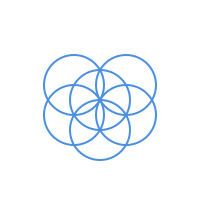
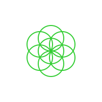
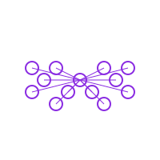
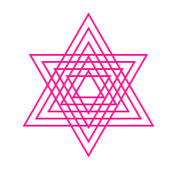
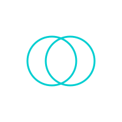
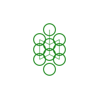
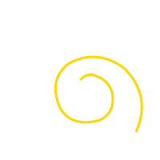
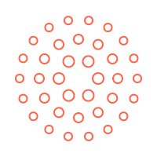
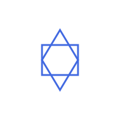

# Sacred Geometry Patterns

This document showcases all available sacred geometry patterns in the video generator.

## Pattern Gallery

### Flower of Life

- **Description**: Central circle surrounded by overlapping circles in perfect symmetry
- **Movement**: Gentle floating with breathing effects
- **Colors**: Dynamic hue cycling with warm tones
- **Sacred Meaning**: Symbol of creation and cosmic order

### Seed of Life

- **Description**: Seven overlapping circles forming the foundation pattern
- **Movement**: Orbital motion with individual circle variations
- **Colors**: Cool blues and greens with shimmer effects
- **Sacred Meaning**: Genesis pattern, blueprint of universe

### Metatron's Cube

- **Description**: 13 circles connected by straight lines forming complex geometry
- **Movement**: Figure-8, circular, or diagonal paths with tilting
- **Colors**: Deep purples and blues with geometric precision
- **Sacred Meaning**: Contains all Platonic solids, divine protection

### Sri Yantra

- **Description**: Nine interlocking triangles creating sacred mandala
- **Movement**: Spiral motion with counter-rotating triangles
- **Colors**: Rich magentas and purples with golden accents
- **Sacred Meaning**: Cosmic energy, divine feminine principle

### Vesica Piscis

- **Description**: Two overlapping circles creating lens-shaped intersection
- **Movement**: Synchronized rotation with breathing overlap
- **Colors**: Cyan and teal with luminous effects
- **Sacred Meaning**: Divine intersection, birth portal

### Tree of Life

- **Description**: Ten spheres (sephirot) connected by 22 paths
- **Movement**: Gentle swaying with pulsing nodes
- **Colors**: Earth tones with golden connections
- **Sacred Meaning**: Kabbalistic map of creation and consciousness

### Golden Spiral

- **Description**: Logarithmic spiral based on phi (1.618) ratio
- **Movement**: Continuous spiral growth and contraction
- **Colors**: Golden yellows and oranges
- **Sacred Meaning**: Divine proportion found throughout nature

### Mandala

- **Description**: Concentric circular patterns with radiating petals
- **Movement**: Rotating rings with individual petal animations
- **Colors**: Rainbow spectrum with center-to-edge gradients
- **Sacred Meaning**: Wholeness, meditation focus, cosmic order

### Hexagram (Star of David)

- **Description**: Two interlocking triangles forming six-pointed star
- **Movement**: Counter-rotating triangles with scaling effects
- **Colors**: Blue and white with stellar brightness
- **Sacred Meaning**: Union of opposites, divine balance

### Pentagram

- **Description**: Five-pointed star with perfect geometric proportions
- **Movement**: Rotation with golden ratio scaling
- **Colors**: Deep reds and golds with mystical aura
- **Sacred Meaning**: Human microcosm, elemental balance

## Technical Features

- **Boundary Behaviors**: Bounce, wrap, or fade at screen edges
- **Dynamic Sizing**: Patterns scale from 38-45% of screen size
- **Color Variation**: Seed-based hue, saturation, and lightness shifts
- **Distortion Effects**: Skewing, scaling, and transform matrices
- **Variable Thickness**: Line weights pulse between 1.5-6 pixels
- **Smooth Transitions**: 8-second pattern duration with 4-second crossfades